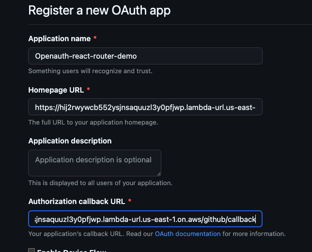
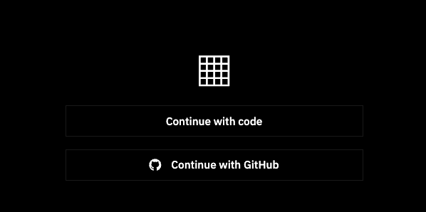
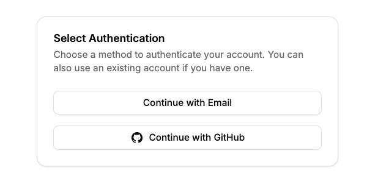

In our [previous journey](/blog/openauth-react-router), we set up an [OpenAuth](https://openauth.js.org/docs/) server, and our [React Router](https://reactrouter.com/en/main) web application's authentication and authorization. We used the `CodeUI` component which comes with OpenAuth to handle the authentication flow. There were promises made at the end of that guide to continue our journey, with a custom UI and a social provider.

Our journey will take us into the depths of the [OpenAuth](https://github.com/toolbeam/openauth) codebase. We will explore the `CodeUI` component, as well as the `CodeProvider` to find what we need to create a custom UI. Then we will set up a social provider to round out our authentication system. And to finish off, I will go over a few things that I have learned along the way.

## Prerequisites

- [Previous Guide](/blog/openauth-react-router)
- Node.js and npm/yarn/bun installed
- Basic familiarity with React and React Router
- Understanding of SST fundamentals
- An AWS account (for SST deployment)

## Custom UI

The first stop on our journey is the `CodeUI` component. Thankfully, the [creators of OpenAuth](https://sst.dev/) have provided pre-built components for OpenAuth to function without any required UI. However, say we want to have a custom UI, or even just make the routes all on our web domain. We can do that by still using the `CodeProvider` but create our own UI.

So what does that look like? Let's take a look at the `CodeUI` component and see what we need to create a custom UI.

```tsx title="CodeUI.tsx" {16,17,46} collapse={18-38, 48-96}
/**
 * Creates a UI for the Code provider flow.
 * @param props - Configure the UI.
 */
export function CodeUI(props: CodeUIOptions): CodeProviderOptions {
  const copy = {
    ...DEFAULT_COPY,
    ...props.copy,
  };

  const mode = props.mode ?? "email";

  return {
    sendCode: props.sendCode,
    length: 6,
    request: async (_req, state, _form, error): Promise<Response> => {
      if (state.type === "start") {
        const jsx = (
          <Layout>
            <form data-component="form" method="post">
              {error?.type === "invalid_claim" && (
                <FormAlert message={copy.email_invalid} />
              )}
              <input type="hidden" name="action" value="request" />
              <input
                data-component="input"
                autofocus
                type={mode === "email" ? "email" : "tel"}
                name={mode === "email" ? "email" : "phone"}
                inputmode={mode === "email" ? "email" : "numeric"}
                required
                placeholder={copy.email_placeholder}
              />
              <button data-component="button">{copy.button_continue}</button>
            </form>
            <p data-component="form-footer">{copy.code_info}</p>
          </Layout>
        );
        return new Response(jsx.toString(), {
          headers: {
            "Content-Type": "text/html",
          },
        });
      }

      if (state.type === "code") {
        const jsx = (
          <Layout>
            <form data-component="form" class="form" method="post">
              {error?.type === "invalid_code" && (
                <FormAlert message={copy.code_invalid} />
              )}
              {state.type === "code" && (
                <FormAlert
                  message={
                    (state.resend ? copy.code_resent : copy.code_sent) +
                    state.claims.email
                  }
                  color="success"
                />
              )}
              <input type="hidden" name="action" value="verify" />
              <input
                data-component="input"
                autofocus
                minLength={6}
                maxLength={6}
                type="text"
                name="code"
                required
                inputmode="numeric"
                autocomplete="one-time-code"
                placeholder={copy.code_placeholder}
              />
              <button data-component="button">{copy.button_continue}</button>
            </form>
            <form method="post">
              {Object.entries(state.claims).map(([key, value]) => (
                <input
                  key={key}
                  type="hidden"
                  name={key}
                  value={value}
                  className="hidden"
                />
              ))}
              <input type="hidden" name="action" value="request" />
              <div data-component="form-footer">
                <span>
                  {copy.code_didnt_get}{" "}
                  <button data-component="link">{copy.code_resend}</button>
                </span>
              </div>
            </form>
          </Layout>
        );
        return new Response(jsx.toString(), {
          headers: {
            "Content-Type": "text/html",
          },
        });
      }

      throw new UnknownStateError();
    },
  };
}
```

The important part of this is the `request` function. This takes in the request, the `state`, form data, and an error. The `state` have the following type:

```typescript title="./src/provider/code.ts" {3,6}
export type CodeProviderState =
  | {
      type: "start";
    }
  | {
      type: "code";
      resend?: boolean;
      code: string;
      claims: Record<string, string>;
    };
```

From this we have learned that we need to handle the `start` and `code` states. And we do this by returning a `Response`. However, instead of the `Response` object, pointing to the OpenAuth server, we can return a `Response` object with a redirect to our own UI routes. Next stop is our `issuer.ts` file. For the `start` state (requesting a code), our form needs 2 inputs: `email` and `action='request'`. The `code` state, we have one form that needs 3 inputs: `code`, `action=verify`, and `email`. This verifies the code. We also need to handle the ability to resend the code. For that, we have another form with an `action=resend` and using the `claims` to populate input(s) (usually the email).

### Issuer Updates

```typescript title="packages/functions/src/auth/issuer.ts" {16,22,28-32}
import { issuer } from "@openauthjs/openauth";
import { UnknownStateError } from "@openauthjs/openauth/error";
import { CodeProvider } from "@openauthjs/openauth/provider/code";
import { handle } from "hono/aws-lambda";
import { authSubjects } from "./subjects";

const app = issuer({
  subjects: authSubjects,
  allow: async () => true,
  providers: {
    email: CodeProvider({
      length: 6,
      sendCode: async (email, code) => {
        console.log("send code: ", email, code);
      },
      async request(_req, state, _form, error) {
        const params = new URLSearchParams();
        // we pass the error to the frontend with a query param
        if (error) {
          params.set("error", error.type);
        }
        if (state.type === "start") {
          return Response.redirect(
            `${process.env.AUTH_FRONTEND_URL}/auth/email?${params.toString()}`,
            302
          );
        }
        if (state.type === "code") {
          params.set("claims", JSON.stringify(state.claims));
          if (state.resend) {
            params.set("resend", "true");
          }
          return Response.redirect(
            `${process.env.AUTH_FRONTEND_URL}/auth/code?${params.toString()}`,
            302
          );
        }

        // OpenAuth throws a UnknownStateError here, so we just mimic it
        throw new UnknownStateError();
      },
    }),
  },
  success: async (ctx, value) => {
    console.log("Success", JSON.stringify(value));
    if (value.provider === "email") {
      const email = value.claims.email;
      if (!email) {
        throw new Error("No email found");
      }

      return ctx.subject(
        "account",
        { type: "email", email },
        { subject: email }
      );
    }

    throw new Error("Invalid provider");
  },
});

export const handler = handle(app);
```

Ookie Dookie, what's going on here? In the `request` function, we are redirecting to our own UI routes: `/auth/email` and `/auth/code`. We are also passing the error to the frontend with a query param. This is so we can handle the potential error on the frontend. For the `code` state, we add in the `claims` and `resend` query params. The `claims` contains the email address and the `resend` is a boolean to indicate if the code was resent.

Be sure to update the `sst.config.ts` file to include the `AUTH_FRONTEND_URL` environment variable. This is the URL of our frontend. We will use this to redirect to our own UI routes.

```typescript title="sst.config.ts" {22-24}
/// <reference path="./.sst/platform/config.d.ts" />

export default $config({
  app(input) {
    return {
      name: "openauth-react-router",
      removal: input?.stage === "production" ? "retain" : "remove",
      protect: ["production"].includes(input?.stage),
      home: "aws",
      providers: {
        aws: {
          region: "us-east-1",
          profile: "your-aws-profile", // replace with your AWS profile
        },
      },
    };
  },
  async run() {
    const auth = new sst.aws.Auth("AuthServer", {
      issuer: {
        handler: "./packages/functions/src/auth/issuer.handler",
        environment: {
          AUTH_FRONTEND_URL: "http://localhost:5173",
        },
      },
    });

    new sst.aws.React("Web", {
      environment: {
        VITE_AUTH_URL: auth.url,
        VITE_SITE_URL: "http://localhost:5173",
      },
    });
  },
});
```

### Email Route

Alrighty then, let's create our email route.

```tsx title="app/routes/auth/email.tsx" {19,24,27-34}
import { useNavigation, useSearchParams } from "react-router";
import { Card, CardContent, CardFooter } from "../../components/ui/card";
import { Input } from "../../components/ui/input";
import { Label } from "../../components/ui/label";
import { StatusButton } from "../../components/ui/status-button";

export default function EmailAuthRoute() {
  const [searchParams] = useSearchParams();
  const error = searchParams.get("error");
  const isPending = useNavigation().state !== "idle";

  return (
    <div className="flex justify-center items-center h-screen">
      <Card className="w-full max-w-lg">
        <CardContent className="pt-6">
          <form
            method="post"
            className="grid gap-4"
            action={`${import.meta.env.VITE_AUTH_URL}/email/authorize`}
          >
            {error === "invalid_claim" && (
              <FormAlert message={"Invalid email address"} />
            )}
            <input type="hidden" name="action" value="request" />
            <div className="grid gap-2">
              <Label htmlFor="email">Email address</Label>
              <Input
                type="email"
                name="email"
                id="email"
                autoFocus
                autoComplete="email"
                placeholder="Email address"
              />
            </div>
            <StatusButton
              type="submit"
              status={isPending ? "pending" : error ? "error" : "idle"}
            >
              Continue
            </StatusButton>
          </form>
        </CardContent>
        <CardFooter>
          <p className="text-sm text-muted-foreground">
            We&apos;ll send you a code to your email address
          </p>
        </CardFooter>
      </Card>
    </div>
  );
}

function FormAlert({ message }: { message: string }) {
  return (
    <div
      data-component="alert"
      className="bg-red-100 text-red-700 border border-red-300 rounded p-4 mb-4"
    >
      {message}
    </div>
  );
}
```

First we make sure to set the `form` `action` to the OpenAuth server's email authorize route. This is so we can handle the request and verify the email address. I also want to call out the hidden input for the `action` and the `input` for the `email` address.

### Code Route

For the code route, we need to handle two things:

1. A OTP input field to verify the codes
   - hidden `action` input of `verify`
2. A form to allow the user to request a new code
   - hidden `action` input of `resend`

We want to follow OpenAuth's `CodeUI` component functionality, so let's review the important parts.

```tsx title="CodeUI.tsx" {16,23,32-41}
if (state.type === "code") {
  <Layout>
    <form data-component="form" class="form" method="post">
      {error?.type === "invalid_code" && (
        <FormAlert message={copy.code_invalid} />
      )}
      {state.type === "code" && (
        <FormAlert
          message={
            (state.resend ? copy.code_resent : copy.code_sent) +
            state.claims.email
          }
          color="success"
        />
      )}
      <input type="hidden" name="action" value="verify" />
      <input
        data-component="input"
        autofocus
        minLength={6}
        maxLength={6}
        type="text"
        name="code"
        required
        inputmode="numeric"
        autocomplete="one-time-code"
        placeholder={copy.code_placeholder}
      />
      <button data-component="button">{copy.button_continue}</button>
    </form>
    <form method="post">
      {Object.entries(state.claims).map(([key, value]) => (
        <input
          key={key}
          type="hidden"
          name={key}
          value={value}
          className="hidden"
        />
      ))}
      {/* the value I think should be resend, so I'll be submitting a PR to fix 🚧 */}
      <input type="hidden" name="action" value="request" />
      <div data-component="form-footer">
        <span>
          {copy.code_didnt_get}{" "}
          <button data-component="link">{copy.code_resend}</button>
        </span>
      </div>
    </form>
  </Layout>;
}
```

Now let's create our code route.

```tsx title="app/routes/auth/code.tsx" {59,66,89-98}
import { Loader2Icon } from "lucide-react";
import { useEffect, useRef } from "react";
import { useNavigation, useSearchParams } from "react-router";
import {
  Card,
  CardContent,
  CardFooter,
  CardHeader,
  CardTitle,
} from "../../components/ui/card";
import { OTPField } from "../../components/ui/forms";

export default function CodeAuthRoute() {
  const [searchParams] = useSearchParams();
  const error = searchParams.get("error");
  const resend = searchParams.get("resend");
  const claims = useClaims();
  const isPending = useNavigation().state !== "idle";

  const formRef = useRef<HTMLFormElement>(null);
  const inputRef = useRef<HTMLInputElement>(null);
  const wrapperRef = useRef<HTMLDivElement>(null);

  useEffect(() => {
    function handleClickAway() {
      if (inputRef.current) {
        inputRef.current.focus();
      }
    }

    const el = wrapperRef.current;
    if (!el) return;
    el.addEventListener("click", handleClickAway);

    return () => {
      el.removeEventListener("click", handleClickAway);
    };
  }, []);

  return (
    <div className="flex justify-center items-center h-screen">
      <Card className="w-full max-w-lg">
        <CardHeader>
          <CardTitle className="text-center text-xl">Enter pin code</CardTitle>
        </CardHeader>
        <CardContent>
          <form
            ref={formRef}
            method="post"
            action={`${import.meta.env.VITE_AUTH_URL}/email/authorize`}
            className="grid gap-4"
          >
            {error === "invalid_code" && <FormAlert message={"Invalid code"} />}
            <FormMessage
              message={`${resend ? "Code resent" : "Code sent"} to ${
                claims?.email
              }`}
            />
            <input type="hidden" name="action" value="verify" />
            <OTPField
              className="place-self-center"
              ref={inputRef}
              inputProps={{
                type: "text",
                className: "uppercase",
                name: "code",
                required: true,
                autoComplete: "one-time-code",
                autoFocus: true,
                onComplete: () => {
                  if (!formRef.current) return;
                  formRef.current.submit();
                },
              }}
            />
            {isPending ? (
              <div className="flex items-center justify-center">
                <Loader2Icon className="animate-spin size-8" />
              </div>
            ) : null}
          </form>
        </CardContent>
        <CardFooter>
          <form
            method="post"
            action={`${import.meta.env.VITE_AUTH_URL}/email/authorize`}
            className="w-full"
          >
            {Object.entries(claims).map(([key, value]) => (
              <input
                key={key}
                type="hidden"
                name={key}
                value={value as string}
                className="hidden"
              />
            ))}
            <input type="hidden" name="action" value="resend" />
            <p className="text-sm text-muted-foreground text-center w-full">
              Did not receive a code?{" "}
              <button type="submit" className="text-primary hover:underline">
                Resend code
              </button>
            </p>
          </form>
        </CardFooter>
      </Card>
    </div>
  );
}

function FormAlert({ message }: { message: string }) {
  return (
    <div
      data-component="alert"
      className="bg-red-100 text-red-700 border border-red-300 rounded p-4 mb-4"
    >
      {message}
    </div>
  );
}

function FormMessage({ message }: { message: string }) {
  return (
    <div
      data-component="alert"
      className="bg-green-100 text-center text-green-700 border border-green-300 rounded p-4 mb-4"
    >
      {message}
    </div>
  );
}

function useClaims() {
  const [searchParams] = useSearchParams();
  const claims = searchParams.get("claims");
  try {
    return claims ? JSON.parse(claims) : null;
  } catch {
    return null;
  }
}
```

### Test it out

At this point, we can test out our new UI routes for the email and code routes.

```bash title="sst dev"
bun sst dev
```

## Slight Detour back to the OpenAuth codebase

The way the OpenAuth `issuer` is currently written, is that when there is only one provider, it will automatically pick that provider as the authorizer. However, when there are multiple providers, OpenAuth will show a _select_ route, which shows the available options based on what you have configured in your `issuer` file.

```typescript title="openauth/packages/openauth/src/issuer.ts" {3,55-57,60-65} showLineNumbers startLineNumber=1012
// ...
app.get("/authorize", async (c) => {
  const provider = c.req.query("provider");
  const response_type = c.req.query("response_type");
  const redirect_uri = c.req.query("redirect_uri");
  const state = c.req.query("state");
  const client_id = c.req.query("client_id");
  const audience = c.req.query("audience");
  const code_challenge = c.req.query("code_challenge");
  const code_challenge_method = c.req.query("code_challenge_method");
  const authorization: AuthorizationState = {
    response_type,
    redirect_uri,
    state,
    client_id,
    audience,
    pkce:
      code_challenge && code_challenge_method
        ? {
            challenge: code_challenge,
            method: code_challenge_method,
          }
        : undefined,
  } as AuthorizationState;
  c.set("authorization", authorization);

  if (!redirect_uri) {
    return c.text("Missing redirect_uri", { status: 400 });
  }

  if (!response_type) {
    throw new MissingParameterError("response_type");
  }

  if (!client_id) {
    throw new MissingParameterError("client_id");
  }

  if (input.start) {
    await input.start(c.req.raw);
  }

  if (
    !(await allow()(
      {
        clientID: client_id,
        redirectURI: redirect_uri,
        audience,
      },
      c.req.raw
    ))
  )
    throw new UnauthorizedClientError(client_id, redirect_uri);
  await auth.set(c, "authorization", 60 * 60 * 24, authorization);
  if (provider) return c.redirect(`/${provider}/authorize`);
  const providers = Object.keys(input.providers);
  if (providers.length === 1) return c.redirect(`/${providers[0]}/authorize`);
  return auth.forward(
    c,
    await select()(
      Object.fromEntries(
        Object.entries(input.providers).map(([key, value]) => [key, value.type])
      ),
      c.req.raw
    )
  );
});
```

The important parts for us right now are:

- if a `provider` is supplied, the OpenAuth issuer will redirect to the `/${provider}/authorize` route
- else if there is only one provider, the OpenAuth issuer will redirect to the `/${provider}/authorize` route
- otherwise, the OpenAuth issuer will forward the request to the `select` route, passing in the available providers and the request

So the question at this point is; what does the OpenAuth `select` route look like?

```tsx title="openauth/packages/openauth/src/ui/select.tsx" {9,10,12,15} showLineNumbers startLineNumber=62
export function Select(props?: SelectProps) {
  return async (
    providers: Record<string, string>,
    _req: Request
  ): Promise<Response> => {
    const jsx = (
      <Layout>
        <div data-component="form">
          {Object.entries(providers).map(([key, type]) => {
            const match = props?.providers?.[key];
            if (match?.hide) return;
            const icon = ICON[key];
            return (
              <a
                href={`/${key}/authorize`}
                data-component="button"
                data-color="ghost"
              >
                {icon && <i data-slot="icon">{icon}</i>}
                Continue with {match?.display || DISPLAY[type] || type}
              </a>
            );
          })}
        </div>
      </Layout>
    );

    return new Response(jsx.toString(), {
      headers: {
        "Content-Type": "text/html",
      },
    });
  };
}
```

Our exploration has given us a few things:

- We need to create links for each available provider to the `/${provider}/authorize` route on the OpenAuth server
- We will need to show icons based on the provider as well as a label

However, given that we will need another provider configured in our `issuer` file before we can see the `select` route, we will now setup the GitHub social provider. We will come back to the `select` route after we have configured the GitHub provider.

## Social Provider

### Subject Updates

We will be first updating our `subjects` file to include the new `OAuthAccount` type.

```tsx title="functions/src/auth/subjects.ts" {10-18,20}
import { createSubjects } from "@openauthjs/openauth/subject";
import { z } from "zod";

const EmailAccount = z.object({
  type: z.literal("email"),
  email: z.string(),
});
export type EmailAccount = z.infer<typeof EmailAccount>;

const OAuthAccount = z.object({
  type: z.literal("oauth"),
  id: z.string(),
  email: z.string(),
  imageUrl: z.string().optional(),
  name: z.string().optional(),
  provider: z.string(),
});
export type OAuthAccount = z.infer<typeof OAuthAccount>;

const AccountSchema = z.discriminatedUnion("type", [
  EmailAccount,
  OAuthAccount,
]);
export type Account = z.infer<typeof AccountSchema>;

export const authSubjects = createSubjects({
  account: AccountSchema,
});
```

This will allow us access to the `OAuthAccount` subject type. We will be using this to save the provider's information in our database related to the user.

**Note:** This is not required, however, you will see shortly why I have done this.

### GitHub Provider Configuration

Configuring the `issuer` to use the `GitHubProvider` is fairly straightforward. The one part that is a bit tricky is to just make sure that we are getting a verified email from GitHub.

```typescript title="./packages/functions/src/auth/issuer.ts" {44-48,65,67,79,88,92,112,118} collapse={1-6,12-43,52-63}
import { issuer } from "@openauthjs/openauth";
import { UnknownStateError } from "@openauthjs/openauth/error";
import { CodeProvider } from "@openauthjs/openauth/provider/code";
import { handle } from "hono/aws-lambda";
import { authSubjects } from "./subjects";
import { GithubProvider } from "@openauthjs/openauth/provider/github";

const app = issuer({
  subjects: authSubjects,
  allow: async () => true,
  providers: {
    email: CodeProvider({
      length: 6,
      sendCode: async (email, code) => {
        console.log("send code: ", email, code);
      },
      async request(_req, state, _form, error) {
        const params = new URLSearchParams();
        // we pass the error to the frontend with a query param
        if (error) {
          params.set("error", error.type);
        }
        if (state.type === "start") {
          return Response.redirect(
            `${process.env.AUTH_FRONTEND_URL}/auth/email?${params.toString()}`,
            302
          );
        }
        if (state.type === "code") {
          params.set("claims", JSON.stringify(state.claims));
          if (state.resend) {
            params.set("resend", "true");
          }
          return Response.redirect(
            `${process.env.AUTH_FRONTEND_URL}/auth/code?${params.toString()}`,
            302
          );
        }

        // OpenAuth throws a UnknownStateError here, so we just mimic it
        throw new UnknownStateError();
      },
    }),
    github: GithubProvider({
      clientID: Resource.GITHUB_CLIENT_ID.value,
      clientSecret: Resource.GITHUB_CLIENT_SECRET.value,
      scopes: ["read:user", "user:email"],
    }),
  },
  success: async (ctx, value) => {
    console.log("Success", JSON.stringify(value));
    if (value.provider === "email") {
      const email = value.claims.email;
      if (!email) {
        throw new Error("No email found");
      }

      return ctx.subject(
        "account",
        { type: "email", email },
        { subject: email }
      );
    }

    if (value.provider === "github") {
      const access = value.tokenset.access;
      const userResponse = await fetch("https://api.github.com/user", {
        headers: {
          Authorization: `Bearer ${access}`,
          Accept: "application/vnd.github.v3+json",
          "X-GitHub-Api-Version": "2022-11-28",
        },
      });
      const user = (await userResponse.json()) as GitHubUser;
      if (!user) {
        throw new Error("No user found");
      }

      const emailResponse = await fetch("https://api.github.com/user/emails", {
        headers: {
          Authorization: `Bearer ${access}`,
          Accept: "application/vnd.github.v3+json",
          "X-GitHub-Api-Version": "2022-11-28",
        },
      });
      const emails = (await emailResponse.json()) as GitHubEmail[];
      const primary = emails.find((email) => email.primary);
      if (!primary?.verified) {
        throw new Error("Email not verified");
      }

      return ctx.subject(
        "account",
        {
          type: "oauth",
          id: typeof user.id === "number" ? user.id.toString() : user.id,
          email: primary.email,
          name: user.name,
          imageUrl: user.avatar_url,
          provider: "github",
        },
        { subject: primary.email }
      );
    }

    throw new Error("Invalid provider");
  },
});

export const handler = handle(app);

interface GitHubEmail {
  email: string;
  primary: boolean;
  verified: boolean;
  visibility: string | null;
}
interface GitHubUser {
  login: string;
  id: string | number;
  name: string | undefined;
  avatar_url: string | undefined;
}
```

First we add the `GithubProvider` to the `providers` object. Then we update the `success` function to handle the `github` provider. In the `success` function, we are getting the user's information from the GitHub API. We are also getting the user's email from the GitHub API. We are then returning the `OAuthAccount` subject. On line 88 of the above code, we are checking if the email is verified before continuing. The `access` token on line 66 is the one GitHub provides to us, this is **ONLY** for the GitHub API. The interfaces for the [`GitHubEmail`](https://docs.github.com/en/rest/users/emails?apiVersion=2022-11-28#list-email-addresses-for-the-authenticated-user) and [`GitHubUser`](https://docs.github.com/en/rest/users/users?apiVersion=2022-11-28#get-the-authenticated-user) are just to help us type the response from the GitHub API.

### GitHub

You will notice that we are using the SST `Resource` to get the `GITHUB_CLIENT_ID` and `GITHUB_CLIENT_SECRET`. Therefore, we will need to define these in our `sst.config.ts` file.

### Update `sst.config.ts`

```typescript title="sst.config.ts" {20,21,23,31} collapse={1-17,35-41}
/// <reference path="./.sst/platform/config.d.ts" />

export default $config({
  app(input) {
    return {
      name: "openauth-react-router",
      removal: input?.stage === "production" ? "retain" : "remove",
      protect: ["production"].includes(input?.stage),
      home: "aws",
      providers: {
        aws: {
          region: "us-east-1",
          profile: "bc-sandbox",
        },
      },
    };
  },
  async run() {
    const secrets = {
      GITHUB_CLIENT_ID: new sst.Secret("GITHUB_CLIENT_ID"),
      GITHUB_CLIENT_SECRET: new sst.Secret("GITHUB_CLIENT_SECRET"),
    };
    const allSecrets = Object.values(secrets);

    const auth = new sst.aws.Auth("AuthServer", {
      issuer: {
        handler: "./packages/functions/src/auth/issuer.handler",
        environment: {
          AUTH_FRONTEND_URL: "http://localhost:5173",
        },
        link: [...allSecrets],
      },
    });

    new sst.aws.React("Web", {
      environment: {
        VITE_AUTH_URL: auth.url,
        VITE_SITE_URL: "http://localhost:5173",
      },
    });
  },
});
```

To get your `GITHUB_CLIENT_ID` and `GITHUB_CLIENT_SECRET`, you will need to create a new OAuth application in your GitHub account. You can do this by going to [https://github.com/settings/applications/new](https://github.com/settings/applications/new).



#### Important

- The `Application name` can be anything you want.
- The `Homepage URL` should be your OpenAuth server URL.
- The `Authorization callback URL` should be your OpenAuth server URL + `/<provider>/callback`. For example, if your OpenAuth server URL is `https://auth.example.com`, then the `Authorization callback URL` should be `https://auth.example.com/github/callback`.

Once created, you will have your `GITHUB_CLIENT_ID` and `GITHUB_CLIENT_SECRET`. To set them in your SST stage(s), you can use the SST CLI. We will use the `--fallback` flag to set the secrets in all the stages quickly.

```bash
bun sst secrets set --fallback GITHUB_CLIENT_ID <your-github-client-id>
bun sst secrets set --fallback GITHUB_CLIENT_SECRET <your-github-client-secret>
```

We can now run our SST dev environment and view the OpenAuth provided Select UI route.

```bash
bun sst dev
```



Before we can test this out fully, we need to update our Onboarding flow to handle the `oauth` account subject type.

### Update Onboarding Flow

```tsx title="app/routes/auth/onboarding.tsx" {4,24,25,69-79,147-161,241-248,253-261} collapse={9-17,40-65,89-100,103-132,167-221,226-238} startLineNumber=20
export const OnboardingSchema = z.object({
  email: z.string().email(),
  name: z.string(),
  imageUrl: z.string().optional(),
  redirectTo: z.string().optional(),
});

export async function loader({ request }: Route.LoaderArgs) {
  const { email, provider } = await requireOnboardingData(request);
  const authSession = await authSessionStorage.getSession(
    request.headers.get("cookie")
  );

  const formError = authSession.get("error");
  const hasError = typeof formError === "string";

  return data({
    email: email,
    status: "idle",
    submission: {
      status: hasError ? "error" : undefined,
      initialValue: {
        email: email,
        name: provider?.name,
        imageUrl: provider?.imageUrl,
      },
      error: { "": hasError ? [formError] : [] },
    } as SubmissionResult,
  });
}

export async function action({ request }: Route.ActionArgs) {
  const onboardingData = await requireOnboardingData(request);
  const formData = await request.formData();

  const submission = await parseWithZod(formData, {
    async: true,
    schema: (intent) =>
      OnboardingSchema.superRefine(async (data, ctx) => {
        try {
          const existingUser = await UserService.userByEmail(data.email);
          if (existingUser) {
            ctx.addIssue({
              code: z.ZodIssueCode.custom,
              message: "A user with this email already exists.",
              path: ["email"],
            });
            return;
          }
          if (data.email !== onboardingData.email) {
            ctx.addIssue({
              code: z.ZodIssueCode.custom,
              message: "Email does not match the email provided.",
              path: ["email"],
            });
            return;
          }
        } catch (error) {
          console.error("Error verifying token:", error);
          ctx.addIssue({
            code: z.ZodIssueCode.custom,
            message: "An error occurred while verifying the token.",
            path: ["email"],
          });
        }
      }).transform(async (data) => {
        if (intent !== null) return { ...data, headers: null };

        if (onboardingData.provider) {
          const { headers } = await handleSignupWithProvider({
            email: data.email,
            name: data.name,
            imageUrl: data.imageUrl,
            providerName: onboardingData.provider.provider,
            providerAccountId: onboardingData.provider.providerAccountId,
            tokens: onboardingData.tokens,
          });
          return { ...data, headers };
        }

        const { headers } = await handleSignup({
          email: data.email,
          name: data.name,
          tokens: onboardingData.tokens,
        });
        return { ...data, headers };
      }),
  });

  if (submission.status !== "success" || !submission.value.headers) {
    return data(
      { result: submission.reply() },
      { status: submission.status === "error" ? 400 : 200 }
    );
  }

  const { redirectTo, headers } = submission.value;

  return redirect(safeRedirect(redirectTo, "/protected"), { headers });
}

export default function OnboardingProviderRoute() {
  const loaderData = useLoaderData<typeof loader>();
  const actionData = useActionData<typeof action>();

  const [searchParams] = useSearchParams();
  const redirectTo = searchParams.get("redirectTo");

  const isPending = useIsPending();

  const [form, fields] = useForm({
    id: "onboarding-form",
    constraint: getZodConstraint(OnboardingSchema),
    lastResult: actionData?.result ?? loaderData.submission,
    onValidate({ formData }) {
      return parseWithZod(formData, { schema: OnboardingSchema });
    },
    shouldRevalidate: "onBlur",
  });

  return (
    <div className="min-h-screen flex items-center justify-center bg-background">
      <div className=" flex p-8 flex-col items-center justify-center gap-6 rounded-lg shadow-md w-full max-w-xl bg-card">
        <header className="mb-2 flex flex-col gap-2">
          <h1 className="font-display text-center text-5xl font-semibold text-foreground">
            Create your account
          </h1>
          <p className="text-center text-base font-normal text-muted-foreground">
            Join thousands of users today
          </p>
        </header>

        <div className="space-y-8 w-full">
          <Form
            method="POST"
            autoComplete="off"
            className="flex w-full flex-col items-start gap-1"
            {...getFormProps(form)}
          >
            <HoneypotInputs />
            {redirectTo ? (
              <input
                {...getInputProps(fields.redirectTo, { type: "hidden" })}
                value={redirectTo}
              />
            ) : null}
            {fields.imageUrl.initialValue ? (
              <div className="mb-4 flex w-full flex-col items-center justify-center gap-4">
                
                <p className="text-body-sm text-muted-foreground">
                  You can change your photo later
                </p>
                <input
                  {...getInputProps(fields.imageUrl, { type: "hidden" })}
                />
              </div>
            ) : null}
            <div className="grid w-full grid-cols-1 gap-6 md:grid-cols-6">
              <div className="col-span-full md:col-span-full md:col-start-1">
                <Field
                  labelProps={{
                    children: "Name",
                  }}
                  inputProps={{
                    ...getInputProps(fields.name, {
                      type: "text",
                    }),
                    autoFocus: true,
                  }}
                  errors={fields.name.errors}
                />
              </div>

              <div className="col-span-full md:col-span-full">
                <Field
                  labelProps={{
                    children: "Email",
                  }}
                  inputProps={{
                    ...getInputProps(fields.email, { type: "email" }),
                    className: "lowercase",
                    autoComplete: "email",
                    readOnly: true,
                  }}
                  errors={fields.email.errors}
                />
              </div>
            </div>
            <div>
              <ErrorList errors={form.errors} id={form.errorId} />
            </div>
            <div className="mt-8 w-full">
              <StatusButton
                type="submit"
                status={isPending ? "pending" : form.status ?? "idle"}
                className="w-full"
              >
                Create Account
              </StatusButton>
            </div>
          </Form>

          <Form method="POST" action="/logout">
            <p className="text-body-sm text-muted-foreground">
              Want to use a different email?{" "}
              <button
                type="submit"
                className="text-body-sm text-muted-foreground hover:underline"
              >
                Sign out
              </button>
            </p>
          </Form>
        </div>
      </div>
    </div>
  );
}

async function requireOnboardingData(request: Request) {
  const sessionData = await requireSessionData(request);
  if (!sessionData.tokens) {
    throw new Error("No tokens found");
  }
  const verified = await authenticator.verifyToken(sessionData.tokens.access);
  if (verified.err) {
    throw new Error("Invalid token");
  }
  const result = z
    .object({
      email: z.string().email(),
      tokens: z.object({
        access: z.string(),
        refresh: z.string(),
        expiresIn: z.number(),
      }),
      provider: z
        .object({
          provider: z.string(),
          providerAccountId: z.string(),
          name: z.string().optional(),
          imageUrl: z.string().optional(),
        })
        .optional(),
    })
    .safeParse({
      email: verified.subject.properties.email,
      tokens: sessionData.tokens,
      provider:
        verified.subject.properties.type === "oauth"
          ? {
              provider: verified.subject.properties.provider,
              providerAccountId: verified.subject.properties.id,
              name: verified.subject.properties.name,
              imageUrl: verified.subject.properties.imageUrl,
            }
          : undefined,
    });
  if (!result.success) {
    console.log("requireOnboardingData: result", result);
    throw await authenticator.authorize(request);
  }
  return result.data;
}
```

#### Require Onboarding Data Explanation

Remember when we defined the `OAuthAccount` type in our subjects with fields like `name` and `imageUrl`? Now, in our onboarding loader and data handling, we'll leverage these richer details if the user authenticated via an OAuth provider like GitHub. We can prefill the form with the user's name and show them a preview of their profile picture.

### Handle Auth Callback

```typescript title="app/modules/auth/auth.server.ts" {25-32} collapse={4-15} startLineNumber=26
export async function handleAuthCallback(request: Request) {
  try {
    const { tokens, headers: exchangeHeaders } = await authenticator.exchange(
      request
    );
    const verified = await authenticator.verifyToken(tokens.access, {
      refresh: tokens.refresh,
    });

    if (verified.err) {
      throw redirect("/", {
        headers: combineHeaders(
          await sessionController.destroySession(request),
          exchangeHeaders
        ),
      });
    }

    if (verified.subject.type !== "account") {
      throw new Error("Invalid subject type");
    }

    if (verified.subject.properties.type === "email") {
      return handleEmailFlow({
        tokens,
        verified: verified.subject.properties,
        exchangeHeaders,
      });
    }

    if (verified.subject.properties.type === "oauth") {
      return handleOAuthFlow({
        tokens,
        verified: verified.subject.properties,
        exchangeHeaders,
        request,
      });
    }

    throw new Error("Invalid subject type");
  } catch (error) {
    if (error instanceof Response) {
      throw error;
    }
    console.error("Error handling callback:", error);
    throw redirect("/logout");
  }
}

export async function handleSignupWithProvider({
  name,
  email,
  imageUrl,
  providerName,
  providerAccountId,
  tokens,
}: {
  name: string;
  email: string;
  imageUrl?: string;
  providerName: string;
  providerAccountId: string;
  tokens: Tokens;
}) {
  const { user, account } = await UserService.signupWithProvider({
    name,
    email,
    imageUrl,
    providerName,
    providerAccountId,
  });
  // session
  const headers = await sessionController.setSessionData({
    tokens,
    expires: getSessionDefaultExpiration(),
  });
  return { user, headers, account };
}

async function handleOAuthFlow({
  request,
  tokens,
  verified,
  exchangeHeaders,
}: {
  request: Request;
  tokens: Tokens;
  verified: OAuthAccount;
  exchangeHeaders: Headers;
}): Promise<{ user: User; headers: Headers }> {
  const existingAccount = await ProviderAccountService.providerAccountById({
    providerAccountId: verified.id,
    providerName: verified.provider,
  });

  const sessionData = await getSessionWithUser(request);
  const sessionUser = sessionData?.user;

  // guard for existing account
  if (existingAccount && sessionUser) {
    if (existingAccount.userId === sessionUser.id) {
      // `/protected` could be replaced with an account management page
      throw redirect("/protected", { headers: exchangeHeaders });
    }
    // account exists but is linked to another user
    throw await redirect("/protected", { headers: exchangeHeaders });
  }

  // handle account linking when user is logged in
  if (sessionUser) {
    await ProviderAccountService.providerAccountCreate({
      userId: sessionUser.id,
      providerName: verified.provider,
      providerAccountId: verified.id,
    });

    throw redirect("/protected", { headers: exchangeHeaders });
  }

  // handle login when there is an existing account
  if (existingAccount) {
    const user = await UserService.userById(existingAccount.userId);
    if (!user) {
      throw new Error("User not found");
    }

    const headers = await sessionController.setSessionData({
      tokens: tokens,
      expires: getSessionDefaultExpiration(),
    });

    return {
      user,
      headers: combineHeaders(headers, exchangeHeaders),
    };
  }

  // check for existing user to login when there is no existing account but user exists with matching email
  const existingUser = await UserService.userByEmail(verified.email);
  if (existingUser) {
    await ProviderAccountService.providerAccountCreate({
      userId: existingUser.id,
      providerName: verified.provider,
      providerAccountId: verified.id,
    });
    const headers = await sessionController.setSessionData({
      tokens: tokens,
      expires: getSessionDefaultExpiration(),
    });
    return {
      user: existingUser,
      headers: combineHeaders(headers, exchangeHeaders),
    };
  }

  // handle signup when there is no existing account and user
  const headers = await sessionController.setSessionData({
    tokens: tokens,
    expires: getSessionDefaultExpiration(),
  });
  throw redirect("/onboarding", {
    headers: combineHeaders(headers, exchangeHeaders),
  });
}
```

#### Handle OAuth Flow Explanation

This function is responsible for the core logic after a successful OAuth authentication. It checks if the user's OAuth account already exists, links it to an existing user if they're already logged in, logs them in if their account and user exist, or directs them to onboarding if it's a new user. This is similar to the [Epic Stack](https://github.com/epicweb-dev/epic-stack/blob/main/app/routes/_auth%2B/auth.%24provider.callback.ts) implementation.

### GitHub Provider Test

Now we are ready to test the GitHub provider auth flow. Remember the full example is available [here](https://github.com/opauth/opauth-react-router-p2).

```base
bun sst dev
```

## Select Route

Time to add the web app base `select` route. This will allow us to select which provider we want to use to authenticate.

```tsx title="app/routes/auth/select.tsx" {30-50} collapse={1-15,57-73}
import { MailIcon } from "lucide-react";
import { useSearchParams } from "react-router";
import { FacebookIcon } from "../../components/icons/facebook";
import { GithubIcon } from "../../components/icons/github";
import { GoogleIcon } from "../../components/icons/google";
import { TwitchIcon } from "../../components/icons/twitch";
import { TwitterIcon } from "../../components/icons/twitter";
import { Button } from "../../components/ui/button";
import {
  Card,
  CardContent,
  CardDescription,
  CardHeader,
  CardTitle,
} from "../../components/ui/card";

export default function AuthenticationSelect() {
  const providers = useProviders();
  return (
    <div className="min-h-screen flex flex-col items-center justify-center">
      <Card className="max-w-md">
        <CardHeader>
          <CardTitle>Select Authentication</CardTitle>
          <CardDescription>
            Choose a method to authenticate your account. You can also use an
            existing account if you have one.
          </CardDescription>
        </CardHeader>
        <CardContent className="w-full grid gap-4">
          {Object.entries(providers).map(([key, type]) => {
            const Icon = ProviderIcons[key as keyof typeof ProviderIcons];
            const url = new URL(
              `${key}/authorize`,
              import.meta.env.VITE_AUTH_URL
            );
            return (
              <Button
                asChild
                variant="outline"
                className="relative w-full"
                key={key}
              >
                <a href={url.toString()}>
                  {Icon && <Icon className="size-5 " />}
                  Continue with {DISPLAY[type as keyof typeof DISPLAY] ||
                    (type as string)}
                </a>
              </Button>
            );
          })}
        </CardContent>
      </Card>
    </div>
  );
}

function useProviders() {
  const [searchParams] = useSearchParams();
  const providers = searchParams.get("providers");
  if (!providers) {
    throw new Response("No providers found", { status: 400 });
  }
  const parsedProviders = parseProviders(providers);
  return parsedProviders;
}

function parseProviders(providers: string) {
  try {
    return JSON.parse(providers) as Record<string, string>;
  } catch {
    throw new Response("Invalid providers", { status: 400 });
  }
}
const DISPLAY: Record<string, string> = {
  twitch: "Twitch",
  google: "Google",
  github: "GitHub",
  x: "X",
  facebook: "Facebook",
  code: "Email",
} as const;

const ProviderIcons: Record<
  string,
  React.ComponentType<React.ComponentProps<"svg">>
> = {
  twitch: TwitchIcon,
  google: GoogleIcon,
  github: GithubIcon,
  x: TwitterIcon,
  facebook: FacebookIcon,
  code: MailIcon,
} as const;
```

The highlighted lines show the links to the `/${provider}/authorize` route which kick off the auth flow.

You will notice that we have defined more icons than just the ones we are using. I just wanted to show this off as the only provider that are shown are based on what is configured in the `issuer` file, and received in the query params.

### Update the Issuer to use the Select Route

Next, we update our OpenAuth `issuer` to use the `select` route.

```typescript title="./packages/functions/src/auth/issuer.ts" {4-8}  startLineNumber=9
const app = issuer({
  subjects: authSubjects,
  allow: async () => true,
  select: async (providers) => {
    const redirectUrl = new URL(`${process.env.AUTH_FRONTEND_URL}/auth/select`);
    redirectUrl.searchParams.set("providers", JSON.stringify(providers));
    return Response.redirect(redirectUrl.toString(), 302);
  },
  providers: {
    // ...
  },
});
```

Make sure your SST dev environment is running.

```bash
bun sst dev
```

With this change, we can now see the custom `select` route in action.



## Turtles all the way down

I have seen the question come up in the SST discord about how we know which URLs to use for the Oauth providers like GitHub. At this time of writing, this specific detail is missing from the OpenAuth doc website. However, OpenAuth does follow a common pattern for the callback endpoint, similar to the [Epic Stack](https://github.com/epicweb-dev/epic-stack/tree/main) doing `auth/<provider>/callback`. Also, it is available in the docs that _never lie_, the OpenAuth codebase.

So back we go to the OpenAuth codebase to see how we can find the URLs for the providers. Our first stop is the GitHub provider file.

```typescript title="openauth/packages/openauth/src/provider/github.ts" {2}  startLineNumber=36
export function GithubProvider(config: GithubConfig) {
  return Oauth2Provider({
    ...config,
    type: "github",
    endpoint: {
      authorization: "https://github.com/login/oauth/authorize",
      token: "https://github.com/login/oauth/access_token",
    },
  });
}
```

The GitHub provider is using the `Oauth2Provider` function to create the provider. The `Oauth2Provider` function is defined in the `provider/oauth2.ts` file. This file is bigger than I want to show here, but I will focus on what is important to us.

```typescript title="openauth/packages/openauth/src/provider/oauth2.ts" {4,31,49}  startLineNumber=10 collapse={5-28,32-46,50-68}
return {
  type: config.type || "oauth2",
  init(routes, ctx) {
    routes.get("/authorize", async (c) => {
      const state = crypto.randomUUID();
      const pkce = config.pkce ? await generatePKCE() : undefined;
      await ctx.set<ProviderState>(c, "provider", 60 * 10, {
        state,
        redirect: getRelativeUrl(c, "./callback"),
        codeVerifier: pkce?.verifier,
      });
      const authorization = new URL(config.endpoint.authorization);
      authorization.searchParams.set("client_id", config.clientID);
      authorization.searchParams.set(
        "redirect_uri",
        getRelativeUrl(c, "./callback")
      );
      authorization.searchParams.set("response_type", "code");
      authorization.searchParams.set("state", state);
      authorization.searchParams.set("scope", config.scopes.join(" "));
      if (pkce) {
        authorization.searchParams.set("code_challenge", pkce.challenge);
        authorization.searchParams.set("code_challenge_method", pkce.method);
      }
      for (const [key, value] of Object.entries(query)) {
        authorization.searchParams.set(key, value);
      }
      return c.redirect(authorization.toString());
    });

    routes.get("/callback", async (c) => {
      const provider = (await ctx.get(c, "provider")) as ProviderState;
      const code = c.req.query("code");
      const state = c.req.query("state");
      const error = c.req.query("error");

      if (error)
        throw new OauthError(
          error.toString() as any,
          c.req.query("error_description")?.toString() || ""
        );
      if (!provider || !code || (provider.state && state !== provider.state)) {
        return c.redirect(getRelativeUrl(c, "./authorize"));
      }

      return handleCallbackLogic(c, ctx, provider, code);
    });

    routes.post("/callback", async (c) => {
      const provider = (await ctx.get(c, "provider")) as ProviderState;

      // Handle form data from POST request
      const formData = await c.req.formData();
      const code = formData.get("code")?.toString();
      const state = formData.get("state")?.toString();
      const error = formData.get("error")?.toString();

      if (error)
        throw new OauthError(
          error as any,
          formData.get("error_description")?.toString() || ""
        );

      if (!provider || !code || (provider.state && state !== provider.state)) {
        return c.redirect(getRelativeUrl(c, "./authorize"));
      }

      return handleCallbackLogic(c, ctx, provider, code);
    });
  },
};
```

So we see that there is an `init` function which get a `routes` (Hono). Then is sets up an `/authorize` get route, and a get and post `/callback` route. Therefore we know that the last part of the URL is `/callback`. But where does the `init` function get called?

Well, we give these providers to the `issuer` when we configure OpenAuth. Let's take a look at the `issuer` file in the OpenAuth codebase. Down to just above where the `issuer` configures the Hono app and the routes, we find the following code.

```typescript title="openauth/packages/openauth/src/issuer.ts" {1}  startLineNumber=728
const app = new Hono<{
  Variables: {
    authorization: AuthorizationState;
  };
}>().use(logger());

for (const [name, value] of Object.entries(input.providers)) {
  const route = new Hono<any>();
  route.use(async (c, next) => {
    c.set("provider", name);
    await next();
  });
  value.init(route, {
    name,
    ...auth,
  });
  app.route(`/${name}`, route);
}
```

We see that we loop over the providers and call the `init` function, and setup a route on the Hono app at `/${name}`. Therefore we know the full path to the callback is `/${provider}/callback`. No docs needed! Codebase exploration to the rescue!

Oh and the title of this section. Well the `issuer` is a Hono app, then the providers themselves are Hono routes. So we have a Hono app, then Hono routes, then Hono routes. Hono all the way down!

## Not all Sunshine and Rainbows

So we have come to the end of our journey. We have a working auth flow, and we know how to configure the providers. However, I want to point out a few things that are not so great.

### No Multi Logins at once

One thing I have seen mentioned about auth setups and flows, is the ability to have multiple accounts logged in at once.


Unfortunately, the above flow will not allow this. It can handle the 1 account with access to 1 or more workspaces / organizations, just not the multiple accounts logged in at once. To me that is perfectly ok. Plus, because of how the Oauth callback flow is handled, it would be a bit of a conflict to set the providers account to the currently logged in user.

If you would like to see an example of how the multi login flow could work, you can take a look at the current `1.0` branch of the [OpenAuth repo](https://github.com/toolbeam/openauth/blob/1.0/packages/react/src/index.tsx). The important part is where the `refresh` token is split and part of it (the email) is used to set the `id` of the account in local storage.

### Token Expiry and Refresh Tokens

In the `getSessionData` function, we use the OpenAuth client's `verify` function. This will refresh the tokens if the access token is expired. This is great, **but** we must ensure that we return those headers in the `loaders` and or `actions` so that our session cookie is also refreshed. This, I believe, will be solved easily once React Router stabilizes their middleware. In that case, the middleware function could ensure that the headers are set in the response.

### Takes 2 Blog Posts to Explain

This is likely a skill issue on my part.

## Conclusion

I hope you enjoyed the journey, and that this guide was helpful. I know this is a bit more work than the current Auth Saas offerings, but the power this unlocks is worth it. The OpenAuth server could be used at any point to protect your backend services. Meaning, your users could login to your website, then you can use their access token to authenticate for your GoLang Api, or it could be used as an AWS App Sync Events API Lambda authorizer. Since OpenAuth is following the OAuth 2.0 spec, it is fully compatible with any service that accepts OAuth JWTs.

## Resources

- [OpenAuth](https://openauth.js.org/docs/)
- [OpenAuth Codebase](https://github.com/toolbeam/openauth)
- [React Router](https://reactrouter.com/en/main)
- [Epic Stack](https://github.com/epicweb-dev/epic-stack)
- [Full Example](https://github.com/natac13/seanpaulcampbell.com/tree/main/examples/openauth-react-router-p2/)
